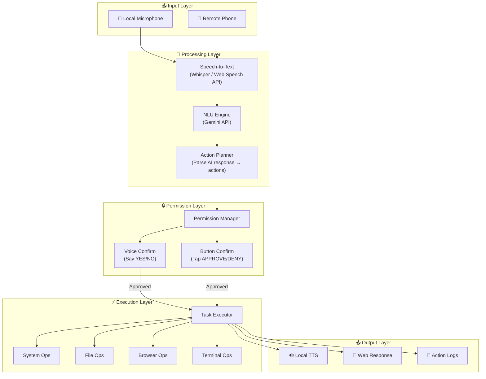
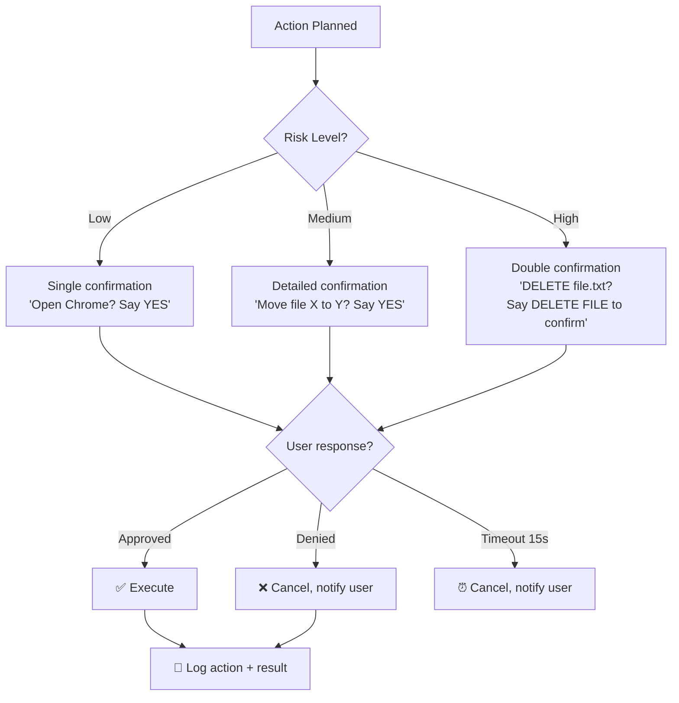
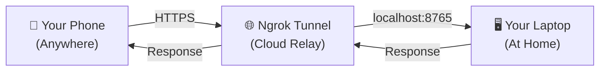
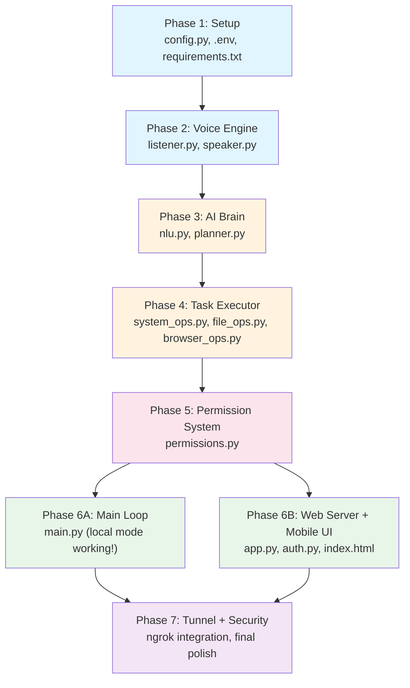

# 🎙️ Voice Agent — Complete Implementation Plan

> **Goal**: Build a Python voice agent that controls your entire computer via voice commands (locally or remotely from a phone), always asking permission before executing.

---

## Table of Contents

1. [High-Level Architecture](#1-high-level-architecture)
2. [Phase 1 — Project Setup & Configuration](#2-phase-1--project-setup--configuration)
3. [Phase 2 — Voice Engine (Listen & Speak)](#3-phase-2--voice-engine-listen--speak)
4. [Phase 3 — AI Brain (Understand Commands)](#4-phase-3--ai-brain-understand-commands)
5. [Phase 4 — Task Executor (Do Things)](#5-phase-4--task-executor-do-things)
6. [Phase 5 — Permission System](#6-phase-5--permission-system)
7. [Phase 6 — Remote Access (Web Server + Mobile UI)](#7-phase-6--remote-access-web-server--mobile-ui)
8. [Phase 7 — Tunneling & Security](#8-phase-7--tunneling--security)
9. [Problem & Solution Matrix](#9-problem--solution-matrix)
10. [Data Flow (End to End)](#10-data-flow-end-to-end)
11. [Testing Strategy](#11-testing-strategy)
12. [Build Order & Dependencies](#12-build-order--dependencies)

---

## 1. High-Level Architecture



---

## 2. Phase 1 — Project Setup & Configuration

### What we're building
A clean project scaffold with dependency management, environment variables, and logging.

### Files to create

#### `requirements.txt`
```
# Speech
openai-whisper         # Offline speech-to-text
SpeechRecognition      # Microphone access
pyaudio                # Audio stream from mic
pyttsx3                # Offline text-to-speech

# AI Brain
google-genai           # Gemini API SDK

# System Control
pyautogui              # Mouse + keyboard automation
psutil                 # CPU, RAM, battery, processes
pyperclip              # Clipboard operations

# Web Server (Remote Access)
fastapi                # Web framework
uvicorn                # ASGI server
websockets             # Real-time communication
python-multipart       # Form data parsing
jinja2                 # HTML template rendering

# Security
python-dotenv          # Load .env files
pyngrok                # Programmatic ngrok tunnel

# Utilities
Pillow                 # Screenshot handling
```

#### `config.py` — Central configuration
```python
# What this file does:
# - Loads API keys from .env
# - Defines all configurable settings
# - Validates that required keys exist on startup

Settings:
  GEMINI_API_KEY        → from .env (REQUIRED)
  NGROK_AUTH_TOKEN      → from .env (for remote access)
  ACCESS_TOKEN          → from .env (secret passphrase for mobile auth)
  WHISPER_MODEL         → "base" (small/medium/large for accuracy)
  LISTEN_TIMEOUT        → 5 seconds
  PHRASE_TIMEOUT        → 10 seconds
  SERVER_PORT           → 8765
  LOG_FILE              → "voiceagent.log"
  RISK_LEVELS           → {"low": auto, "medium": confirm, "high": double-confirm}
```

#### `.env.example`
```
GEMINI_API_KEY=your_gemini_api_key_here
NGROK_AUTH_TOKEN=your_ngrok_token_here
ACCESS_TOKEN=your_secret_passphrase_here
```

### Problems & solutions at this stage

| Problem | Solution |
|---|---|
| PyAudio fails to install on Windows | Ship a pre-built `.whl` link in README, or use `pipwin install pyaudio` |
| User forgets to set API keys | `config.py` validates on startup, prints clear error with instructions |
| Whisper downloads models on first run (slow) | Notify user, show progress, cache in `~/.cache/whisper/` |

---

## 3. Phase 2 — Voice Engine (Listen & Speak)

### 3A. `voice/listener.py` — Microphone Listener

#### What it does
Continuously listens to the microphone, detects speech, converts it to text using Whisper.

#### How it works (step by step)

```
1. Initialize PyAudio microphone stream
2. Use SpeechRecognition's `Recognizer` to detect ambient noise (calibrate 2 sec)
3. Enter listening loop:
   a. Listen for speech (with timeout)
   b. If speech detected → save raw audio to temp WAV
   c. Pass WAV to Whisper model → get transcript text
   d. Clean up text (strip whitespace, lowercase)
   e. Return transcript to main loop
4. Handle silence (no speech) → continue listening
5. Handle KeyboardInterrupt → graceful shutdown
```

#### Key functions

```python
class VoiceListener:
    def __init__(self, model_size="base"):
        """Load Whisper model, init microphone"""

    def calibrate(self):
        """Listen to 2 seconds of ambient noise to set energy threshold"""

    def listen_once(self) -> str | None:
        """Listen for one phrase, return text or None if silence"""

    def listen_for_confirmation(self) -> bool:
        """Listen specifically for YES/NO/APPROVE/DENY"""

    def start_continuous(self, callback: Callable):
        """Start background thread that calls callback(text) on each phrase"""

    def stop(self):
        """Stop listening, release microphone"""
```

#### Edge cases handled

| Edge Case | How we handle it |
|---|---|
| No microphone found | Catch `OSError`, print "No mic detected", offer remote-only mode |
| Background noise triggers false detection | Calibrate energy threshold, use Whisper's silence detection |
| Very long speech (user rambles) | Cap at `PHRASE_TIMEOUT` seconds, process what we have |
| Whisper mishears words | Send raw + cleaned text to Gemini, let AI interpret intent |
| Multiple people speaking | Whisper processes dominant voice; instruct user to speak clearly |
| Mic in use by another app | Catch error, retry after 2 sec, max 3 retries |

---

### 3B. `voice/speaker.py` — Text-to-Speech

#### What it does
Converts text responses into spoken audio using `pyttsx3` (offline, zero-latency).

#### Key functions

```python
class VoiceSpeaker:
    def __init__(self):
        """Init pyttsx3 engine, set voice/rate/volume"""

    def speak(self, text: str):
        """Speak text aloud (blocking)"""

    def speak_async(self, text: str):
        """Speak in background thread (non-blocking)"""

    def set_voice(self, voice_id: str):
        """Switch between available voices (male/female)"""

    def set_speed(self, rate: int = 175):
        """Adjust speaking rate (words per minute)"""

    def list_voices(self) -> list:
        """Return available system voices"""
```

#### Edge cases handled

| Edge Case | How we handle it |
|---|---|
| No audio output device | Catch error, fall back to printing text in terminal |
| pyttsx3 engine busy (called again mid-speech) | Queue system — finish current speech, then speak next |
| Very long text | Break into sentences, speak one by one with small pause |
| Special characters in text | Strip/sanitize before speaking |

---

## 4. Phase 3 — AI Brain (Understand Commands)

### 4A. `brain/nlu.py` — Natural Language Understanding

#### What it does
Sends user's spoken text to **Gemini API** with a carefully crafted system prompt. Gemini returns a **structured JSON** describing what action to take.

#### The System Prompt (Critical)

```
You are a computer control assistant. The user will give you voice commands.
Your job is to understand the intent and return a structured JSON response.

RESPOND ONLY WITH VALID JSON. No markdown, no explanation.

JSON Format:
{
  "understood": true/false,
  "action": "action_type",
  "parameters": { ... },
  "description": "Human-readable description of what will happen",
  "risk_level": "low" | "medium" | "high",
  "confirmation_message": "What to ask the user before executing"
}

Available actions:
- open_app: { "app_name": "chrome" }
- close_app: { "process_name": "chrome.exe" }
- open_url: { "url": "https://..." }
- web_search: { "query": "search terms" }
- type_text: { "text": "hello world" }
- keyboard_shortcut: { "keys": ["ctrl", "s"] }
- run_command: { "command": "dir C:\\Users" }
- file_create: { "path": "...", "content": "..." }
- file_delete: { "path": "..." }
- file_move: { "source": "...", "destination": "..." }
- file_search: { "directory": "...", "pattern": "*.txt" }
- screenshot: {}
- volume_set: { "level": 50 }
- system_info: { "type": "battery" | "cpu" | "ram" | "disk" | "ip" }
- shutdown: { "mode": "shutdown" | "restart" | "sleep" | "lock" }
- mouse_click: { "x": 100, "y": 200, "button": "left" }
- read_screen: {}  (OCR the screen)
- multi_step: { "steps": [ ...array of above actions... ] }

Risk levels:
- low: Info queries, screenshots, opening apps
- medium: File operations, typing, running safe commands
- high: Deleting files, shutdown, running unknown commands, system changes

If you don't understand the command, set "understood": false and suggest
what the user might mean in "confirmation_message".
```

#### Key functions

```python
class NLUEngine:
    def __init__(self, api_key: str):
        """Initialize Gemini client with system prompt"""

    async def understand(self, user_text: str) -> dict:
        """Send text to Gemini, parse JSON response, return action dict"""

    def _validate_response(self, response: dict) -> dict:
        """Ensure response has required fields, handle malformed JSON"""

    def _sanitize_command(self, response: dict) -> dict:
        """Remove dangerous path traversals, validate file paths"""
```

#### How Gemini integration works

```
1. User says: "open Chrome and search for Python tutorials"
2. We send to Gemini with system prompt
3. Gemini returns:
   {
     "understood": true,
     "action": "multi_step",
     "parameters": {
       "steps": [
         {"action": "open_app", "parameters": {"app_name": "chrome"}},
         {"action": "web_search", "parameters": {"query": "Python tutorials"}}
       ]
     },
     "description": "Open Google Chrome, then search for 'Python tutorials'",
     "risk_level": "low",
     "confirmation_message": "I'll open Chrome and search for Python tutorials. Proceed?"
   }
4. We parse this JSON → send to Permission Manager → Execute if approved
```

#### Edge cases handled

| Edge Case | How we handle it |
|---|---|
| Gemini returns non-JSON text | Regex extract JSON from response, retry once if fails |
| Gemini API rate limit | Exponential backoff: 1s → 2s → 4s, max 3 retries |
| Gemini API key invalid | Clear error message with link to get a key |
| Network down (no internet) | Fall back to simple keyword matching for basic commands |
| Ambiguous command ("delete that") | Gemini sets `understood: false`, agent asks for clarification |
| Gemini hallucinates a dangerous action | `_sanitize_command()` strips paths outside user dirs, blocks `format`, `rm -rf /` etc. |
| Gemini returns unknown action type | Reject with "I don't know how to do that yet" |
| Very long/complex command | Gemini handles multi-step; we execute sequentially with permission per step |

---

### 4B. `brain/planner.py` — Action Planner

#### What it does
Takes the structured JSON from Gemini and converts it into executable function calls.

```python
class ActionPlanner:
    def __init__(self, executor: TaskExecutor):
        """Register action_type → executor function mapping"""

    def plan(self, nlu_response: dict) -> list[PlannedAction]:
        """Convert NLU response to list of PlannedAction objects"""

    def execute_plan(self, plan: list[PlannedAction]) -> list[ActionResult]:
        """Execute each action in sequence, collecting results"""

# Data classes
@dataclass
class PlannedAction:
    action_type: str
    parameters: dict
    description: str
    risk_level: str
    requires_permission: bool  # Always True

@dataclass
class ActionResult:
    success: bool
    message: str
    output: Any  # Screenshot bytes, text output, etc.
    error: str | None
```

---

## 5. Phase 4 — Task Executor (Do Things)

### 5A. `executor/system_ops.py` — System Operations

Every function follows the pattern: **validate inputs → execute → return result**.

```python
class SystemOps:

    # === APPLICATION MANAGEMENT ===

    def open_app(self, app_name: str) -> ActionResult:
        """
        How: Use a mapping dict for common apps:
          {"chrome": "chrome.exe", "notepad": "notepad.exe", ...}
        If not in map: try subprocess.Popen(app_name)
        If still fails: try os.startfile() with Start Menu search
        Fallback: shell 'start app_name'
        """

    def close_app(self, process_name: str) -> ActionResult:
        """
        How: Use psutil to find process by name → terminate gracefully
        If won't close: force kill after 5 sec timeout
        Safety: Never kill system-critical processes (csrss, svchost, etc.)
        """

    def list_running_apps(self) -> ActionResult:
        """Use psutil.process_iter() to list all running processes"""

    # === SYSTEM CONTROL ===

    def shutdown(self, mode: str) -> ActionResult:
        """
        Commands:
          shutdown → 'shutdown /s /t 5'
          restart  → 'shutdown /r /t 5'
          sleep    → 'rundll32.exe powrprof.dll,SetSuspendState 0,1,0'
          lock     → 'rundll32.exe user32.dll,LockWorkStation'
        Safety: Always 5-second delay, can be cancelled
        """

    def volume_set(self, level: int) -> ActionResult:
        """Use pycaw or nircmd to set system volume (0-100)"""

    def screenshot(self) -> ActionResult:
        """
        Use pyautogui.screenshot() → save to temp file
        Return file path + thumbnail for remote UI
        """

    def system_info(self, info_type: str) -> ActionResult:
        """
        battery → psutil.sensors_battery()
        cpu     → psutil.cpu_percent(interval=1)
        ram     → psutil.virtual_memory()
        disk    → psutil.disk_usage('/')
        ip      → socket.gethostbyname(socket.gethostname())
        """

    # === KEYBOARD & MOUSE ===

    def type_text(self, text: str) -> ActionResult:
        """pyautogui.typewrite(text, interval=0.02)"""

    def keyboard_shortcut(self, keys: list[str]) -> ActionResult:
        """pyautogui.hotkey(*keys)  e.g., hotkey('ctrl', 'c')"""

    def mouse_click(self, x: int, y: int, button: str) -> ActionResult:
        """pyautogui.click(x, y, button=button)"""

    # === TERMINAL ===

    def run_command(self, command: str) -> ActionResult:
        """
        How: subprocess.run(command, shell=True, capture_output=True, timeout=30)
        Safety:
          - BLOCKED commands: format, del /s, rm -rf, reg delete, etc.
          - Timeout: 30 seconds max
          - Output captured and returned
        """
```

### 5B. `executor/browser_ops.py` — Browser Operations

```python
class BrowserOps:

    def open_url(self, url: str) -> ActionResult:
        """
        webbrowser.open(url)
        Validate URL format first (add https:// if missing)
        """

    def web_search(self, query: str) -> ActionResult:
        """
        Open browser with: https://www.google.com/search?q={query}
        URL-encode the query string
        """
```

### 5C. `executor/file_ops.py` — File Operations

```python
class FileOps:

    # Safety: ALL paths are validated against ALLOWED_DIRS
    ALLOWED_DIRS = [
        os.path.expanduser("~\\Documents"),
        os.path.expanduser("~\\Desktop"),
        os.path.expanduser("~\\Downloads"),
    ]

    def _validate_path(self, path: str) -> bool:
        """
        Resolve to absolute path
        Check it's under ALLOWED_DIRS
        Block path traversal (../)
        Block system directories (C:\\Windows, C:\\Program Files)
        """

    def file_create(self, path: str, content: str) -> ActionResult:
        """Create file after path validation"""

    def file_delete(self, path: str) -> ActionResult:
        """
        Delete file (NOT directory by default)
        Move to Recycle Bin instead of permanent delete (using send2trash)
        """

    def file_move(self, source: str, destination: str) -> ActionResult:
        """shutil.move() after validating both paths"""

    def file_copy(self, source: str, destination: str) -> ActionResult:
        """shutil.copy2() after validating both paths"""

    def file_search(self, directory: str, pattern: str) -> ActionResult:
        """
        glob.glob() with pattern
        Limit results to 50 files
        Return names + sizes
        """

    def file_read(self, path: str) -> ActionResult:
        """Read first 1000 lines, return content"""
```

### Blocked/Dangerous operations

```python
BLOCKED_COMMANDS = [
    "format",
    "del /s /q C:\\",
    "rm -rf",
    "reg delete",
    "diskpart",
    "bcdedit",
    "cipher /w",
    "sfc",
    "dism",
    "netsh advfirewall set allprofiles state off",
]

BLOCKED_PATHS = [
    "C:\\Windows",
    "C:\\Program Files",
    "C:\\Program Files (x86)",
    "C:\\ProgramData",
    "$Recycle.Bin",
]
```

---

## 6. Phase 5 — Permission System

### `executor/permissions.py`

This is the **most critical safety layer**. No action executes without user approval.



#### How it works

```python
class PermissionManager:

    def __init__(self, listener: VoiceListener, speaker: VoiceSpeaker):
        """Init with voice I/O for local confirmation"""

    async def request_permission_local(self, action: PlannedAction) -> bool:
        """
        1. Speaker says: action.confirmation_message
        2. Speaker says: "Say YES to approve or NO to cancel"
        3. Listener waits for response (15 sec timeout)
        4. Parse response for YES/APPROVE/DO IT/GO AHEAD → True
        5. Parse response for NO/CANCEL/STOP/DON'T → False
        6. Timeout → False (safe default)
        7. Unclear response → ask again (max 2 retries)
        """

    async def request_permission_remote(self, action: PlannedAction, websocket) -> bool:
        """
        1. Send action details to mobile UI via WebSocket
        2. UI shows: description + APPROVE/DENY buttons
        3. Wait for button click (60 sec timeout for remote)
        4. Return True/False based on response
        """

    def log_decision(self, action: PlannedAction, approved: bool, source: str):
        """
        Log to file: timestamp, action, approved/denied, source (local/remote)
        This creates an audit trail of everything the agent did
        """
```

#### Approval keywords

```python
APPROVE_WORDS = {"yes", "yeah", "yep", "approve", "do it", "go ahead",
                 "proceed", "confirm", "ok", "okay", "sure", "execute"}
DENY_WORDS = {"no", "nope", "cancel", "stop", "don't", "deny",
              "abort", "never", "negative"}
```

---

## 7. Phase 6 — Remote Access (Web Server + Mobile UI)

### 7A. `server/app.py` — FastAPI Server

```python
# What this server does:
# 1. Serves a mobile-friendly web UI
# 2. Handles WebSocket connections for real-time communication
# 3. Receives voice commands from phone → processes → sends results back

@app.get("/")
async def home():
    """Serve the mobile web UI (index.html)"""

@app.post("/auth")
async def authenticate(token: str):
    """
    Validate the secret access token
    Return a session JWT valid for 24 hours
    """

@app.websocket("/ws")
async def websocket_handler(ws: WebSocket):
    """
    1. Validate JWT from query params
    2. Accept connection
    3. Listen for commands:
       - {"type": "command", "text": "open chrome"}
       - {"type": "permission_response", "approved": true}
    4. Process command through NLU → Permission → Executor
    5. Send results back:
       - {"type": "response", "message": "Chrome opened successfully"}
       - {"type": "permission_request", "description": "...", "risk": "..."}
       - {"type": "screenshot", "data": "base64..."}
    """

@app.get("/health")
async def health():
    """Health check endpoint — returns system status"""
```

### 7B. `server/auth.py` — Authentication

```python
class AuthManager:
    def __init__(self, access_token: str):
        """Store hashed access token"""

    def verify_token(self, token: str) -> bool:
        """Compare hashed input with stored hash"""

    def create_session(self) -> str:
        """Generate JWT with 24-hour expiry"""

    def verify_session(self, jwt_token: str) -> bool:
        """Validate JWT signature and expiry"""
```

#### Security flow

```
1. User opens mobile UI → enters secret passphrase
2. Server hashes input → compares with stored hash
3. Match → returns JWT token (24hr expiry)
4. All subsequent WebSocket connections include JWT
5. Invalid/expired JWT → connection refused
```

### 7C. `server/templates/index.html` — Mobile Web UI

#### What the UI looks like

```
┌─────────────────────────────────┐
│  🎙️ Voice Agent Remote Control  │
│─────────────────────────────────│
│                                 │
│  ┌───────────────────────────┐  │
│  │  🔒 Enter Access Code:   │  │
│  │  [________________] [GO] │  │
│  └───────────────────────────┘  │
│                                 │
│  ─── After Login ───            │
│                                 │
│  ┌───────────────────────────┐  │
│  │  Chat Log:                │  │
│  │  🤖 Ready. Listening...   │  │
│  │  👤 Open Chrome           │  │
│  │  🤖 Open Chrome browser?  │  │
│  │  ┌─────────┐ ┌────────┐  │  │
│  │  │✅ APPROVE│ │❌ DENY │  │  │
│  │  └─────────┘ └────────┘  │  │
│  │  🤖 ✅ Chrome opened!    │  │
│  └───────────────────────────┘  │
│                                 │
│  ┌───────────────────────────┐  │
│  │ [Type a command........]  │  │
│  │     🎤 Hold to Speak      │  │
│  └───────────────────────────┘  │
│                                 │
│  ┌──────────────────────────┐   │
│  │ 🔋 85% │ 💻 CPU 23% │ 🟢  │  │
│  └──────────────────────────┘   │
│                                 │
└─────────────────────────────────┘
```

#### UI features

| Feature | Technology |
|---|---|
| Voice input on phone | Web Speech API (`webkitSpeechRecognition`) |
| Voice output on phone | Browser `SpeechSynthesis` API |
| Real-time chat | WebSocket |
| Permission buttons | Dynamic DOM injection |
| System status bar | Polled every 30 seconds |
| Screenshot viewer | Base64 image display |
| Dark mode | CSS media query `prefers-color-scheme` |
| Responsive design | CSS Flexbox, mobile-first |
| Hold-to-speak button | Touch events (`touchstart` / `touchend`) |

#### Web Speech API handling (on phone)

```javascript
// Speech-to-Text on mobile browser
const recognition = new webkitSpeechRecognition();
recognition.continuous = false;
recognition.interimResults = false;
recognition.lang = 'en-US';

holdButton.addEventListener('touchstart', () => recognition.start());
holdButton.addEventListener('touchend', () => recognition.stop());

recognition.onresult = (event) => {
    const text = event.results[0][0].transcript;
    sendToServer(text);  // via WebSocket
};

// Text-to-Speech on mobile browser
function speak(text) {
    const utterance = new SpeechSynthesisUtterance(text);
    window.speechSynthesis.speak(utterance);
}
```

---

## 8. Phase 7 — Tunneling & Security

### How remote access works (the 400km problem)



#### Setup steps

```python
# In main.py — start tunnel programmatically
from pyngrok import ngrok

# Set auth token (one-time)
ngrok.set_auth_token(config.NGROK_AUTH_TOKEN)

# Start tunnel
tunnel = ngrok.connect(config.SERVER_PORT, "http")
public_url = tunnel.public_url

print(f"🌐 Remote access URL: {public_url}")
# The agent SPEAKS the URL aloud so you can note it before leaving
# Also saves to a file: remote_url.txt
```

#### Security layers

```
Layer 1: Ngrok HTTPS encryption (TLS in transit)
Layer 2: Access token authentication (only you know the passphrase)
Layer 3: JWT session tokens (expire after 24 hours)
Layer 4: Rate limiting (max 10 failed auth attempts → 1hr lockout)
Layer 5: Action logging (every command + result logged with timestamp)
Layer 6: Blocked commands list (can't format disk remotely)
Layer 7: File path restrictions (can't touch system files)
Layer 8: Permission system (must approve every action)
```

#### What if ngrok URL changes?

```
Problem: Free ngrok URLs change on every restart
Solutions:
  1. Use ngrok paid plan for fixed subdomain (best)
  2. Agent emails you the new URL on startup (via smtplib)
  3. Agent saves URL to a cloud file (Google Drive / Dropbox)
  4. Use Cloudflare Tunnel instead (free, stable URLs with your domain)
```

---

## 9. Problem & Solution Matrix

### Speech & Audio Problems

| # | Problem | Solution |
|---|---|---|
| 1 | PyAudio won't install | Use `pipwin install pyaudio` or prebuilt wheel |
| 2 | No microphone detected | Graceful error → offer remote-only mode |
| 3 | Background noise triggers commands | Calibrate energy threshold + require wake word "Hey Agent" |
| 4 | Whisper is slow on CPU | Use `base` model (fast); offer `tiny` for speed, `medium` for accuracy |
| 5 | Whisper mishears technical words | Send to Gemini for intelligent interpretation |
| 6 | User speaks non-English | Whisper supports 99 languages; configure in settings |
| 7 | Continuous listening eats CPU | Use VAD (Voice Activity Detection) — only process when speech detected |

### AI / Gemini Problems

| # | Problem | Solution |
|---|---|---|
| 8 | Gemini returns invalid JSON | Regex extract `{...}` from response, retry once |
| 9 | Gemini API rate limited | Exponential backoff: 1→2→4→8 sec, max 3 retries |
| 10 | Gemini is down | Fall back to keyword-matching for basic commands |
| 11 | Gemini hallucinates dangerous commands | Sanitizer blocks dangerous patterns; blocked commands list |
| 12 | Command is ambiguous | Gemini sets `understood: false`, agent asks for clarification |
| 13 | Multi-step command ordering | Gemini plans steps; we execute sequentially |
| 14 | No internet for Gemini | Cache recent commands; use keyword fallback |

### Execution Problems

| # | Problem | Solution |
|---|---|---|
| 15 | App not found on system | Try multiple methods: exe name, start menu, PATH search |
| 16 | Process won't close gracefully | Force kill after 5-second timeout |
| 17 | File path doesn't exist | Return clear error, suggest similar paths |
| 18 | Permission denied on file | Report error, suggest running as admin |
| 19 | Command hangs indefinitely | 30-second timeout on all subprocess calls |
| 20 | Screenshot too large for WebSocket | Compress to JPEG, resize to max 1920px wide |
| 21 | pyautogui failsafe triggered | Catch `FailSafeException`, inform user to move mouse from corner |
| 22 | Multiple monitors | pyautogui handles primary monitor; can specify coordinates |

### Remote Access Problems

| # | Problem | Solution |
|---|---|---|
| 23 | Ngrok URL changes on restart | Save to file, email, or use paid fixed URL |
| 24 | Laptop goes to sleep | Disable sleep when agent is running (powercfg) |
| 25 | Internet drops at home | Agent auto-reconnects tunnel; phone shows "offline" status |
| 26 | WebSocket disconnects | Auto-reconnect with exponential backoff on client side |
| 27 | Multiple people try to connect | Only 1 active session at a time; new connection kicks old one |
| 28 | Phone browser doesn't support Web Speech API | Fall back to text input (always available) |
| 29 | Latency too high | Compress responses, minimize data transfer |
| 30 | Someone brute-forces the token | Rate limit: 10 failed attempts → 1hr lockout |

### General Problems

| # | Problem | Solution |
|---|---|---|
| 31 | Agent crashes | Wrap main loop in try/except, auto-restart, log errors |
| 32 | Memory leak from long sessions | Monitor memory; restart Whisper model every 100 commands |
| 33 | Logs grow too large | Rotate logs: keep last 7 days, max 50MB |
| 34 | User wants to undo last action | Keep undo history for file operations (source/dest pairs) |
| 35 | Conflicting operations (delete while reading) | Lock system: one action at a time, queue others |

---

## 10. Data Flow (End to End)

### Local Flow

```
User speaks: "Create a file called notes.txt on my desktop with today's date"
    │
    ▼
[Microphone] → raw audio bytes
    │
    ▼
[Whisper STT] → "create a file called notes.txt on my desktop with today's date"
    │
    ▼
[Gemini NLU] → {
    "action": "file_create",
    "parameters": {
        "path": "C:\\Users\\HP\\Desktop\\notes.txt",
        "content": "September 27, 2026"
    },
    "description": "Create notes.txt on Desktop with today's date",
    "risk_level": "medium",
    "confirmation_message": "I'll create notes.txt on your Desktop with today's date. Approve?"
}
    │
    ▼
[Permission Manager]
    Speaker: "I'll create notes.txt on your Desktop with today's date. Say YES to approve."
    Listener: waits... user says "yes"
    │
    ▼
[File Ops] → validates path → creates file → returns success
    │
    ▼
[Speaker] → "Done! I've created notes.txt on your Desktop."
[Logger] → logs action + result + timestamp
```

### Remote Flow

```
User taps mic on phone: "What's my battery level?"
    │
    ▼
[Phone Browser Web Speech API] → "what's my battery level"
    │
    ▼
[WebSocket] → JSON: {"type": "command", "text": "what's my battery level"}
    │
    ▼
[FastAPI Server] → validates JWT → passes to NLU
    │
    ▼
[Gemini NLU] → {
    "action": "system_info",
    "parameters": {"type": "battery"},
    "risk_level": "low",
    "confirmation_message": "Check battery level?"
}
    │
    ▼
[Permission Manager] → sends to phone:
    {"type": "permission_request", "description": "Check battery level?"}
    │
    ▼
[Phone UI] → shows APPROVE/DENY buttons → user taps APPROVE
    │
    ▼
[WebSocket] → {"type": "permission_response", "approved": true}
    │
    ▼
[System Ops] → psutil.sensors_battery() → 85%, plugged in
    │
    ▼
[WebSocket → Phone] → {"type": "response", "message": "Battery is at 85%, charging."}
[Phone Browser TTS] → speaks: "Battery is at 85%, charging."
```

---

## 11. Testing Strategy

### Phase-by-phase testing

| Phase | Test | How |
|---|---|---|
| Phase 1 | Config loads correctly | Unit test: load `.env`, verify all keys |
| Phase 2 | Mic captures audio | Manual: speak, verify transcript printed |
| Phase 2 | TTS speaks clearly | Manual: trigger speech, listen |
| Phase 3 | Gemini returns valid JSON | Unit test: send 20 sample commands, validate JSON |
| Phase 3 | Unknown commands handled | Test: "fly me to the moon" → understood: false |
| Phase 4 | Apps open/close | Integration: open notepad, verify with psutil |
| Phase 4 | File operations work | Integration: create/read/delete test file |
| Phase 4 | Blocked commands rejected | Unit test: try "format C:", verify blocked |
| Phase 5 | Permission YES works | Integration: approve action, verify execution |
| Phase 5 | Permission NO works | Integration: deny action, verify no execution |
| Phase 5 | Permission timeout works | Integration: wait 15 sec, verify cancelled |
| Phase 6 | Server starts | Integration: start server, hit /health |
| Phase 6 | WebSocket connects | Integration: connect from browser, send message |
| Phase 6 | Mobile UI loads | Manual: open on phone, verify layout |
| Phase 6 | Voice input on phone | Manual: tap mic, speak, verify command received |
| Phase 7 | Ngrok tunnel works | Integration: start tunnel, access from different network |
| Phase 7 | Auth blocks invalid token | Unit test: send wrong token, verify 401 |
| Phase 7 | Rate limiting works | Unit test: 11 failed attempts, verify lockout |

### Sample test commands

```
Easy (Low Risk):
  "What time is it?"
  "Take a screenshot"
  "What's my battery level?"
  "How much RAM am I using?"

Medium:
  "Open Chrome"
  "Search Google for weather today"
  "Open Notepad and type hello world"
  "Create a file called test.txt on my desktop"

Hard (High Risk):
  "Delete test.txt from my desktop"
  "Restart my computer"
  "Close all applications"
  "Run the command ipconfig in terminal"

Multi-step:
  "Open Chrome, go to YouTube, and search for lofi music"
  "Take a screenshot and save it to my desktop"

Should Fail:
  "Format my hard drive" → BLOCKED
  "Delete system32" → BLOCKED
  "Fly me to the moon" → understood: false
```

---

## 12. Build Order & Dependencies



### Estimated effort per phase

| Phase | What | Estimated Time |
|---|---|---|
| Phase 1 | Setup & Config | 10 minutes |
| Phase 2 | Voice Engine | 20 minutes |
| Phase 3 | AI Brain | 25 minutes |
| Phase 4 | Task Executor | 30 minutes |
| Phase 5 | Permission System | 15 minutes |
| Phase 6A | Main Loop (local) | 15 minutes |
| Phase 6B | Web Server + UI | 30 minutes |
| Phase 7 | Tunnel + Security | 15 minutes |
| **Total** | **Full build** | **~2.5 hours** |

---

## Next Steps

> [!IMPORTANT]
> Before I start coding, you need:
> 1. **Google Gemini API Key** — Get free at [aistudio.google.com](https://aistudio.google.com/)
> 2. **Ngrok Auth Token** — Get free at [ngrok.com](https://ngrok.com/) (for remote access)
> 3. **A secret passphrase** — Any strong password for mobile authentication

Once you approve this plan, I'll build the entire project phase by phase, testing each phase before moving to the next.
